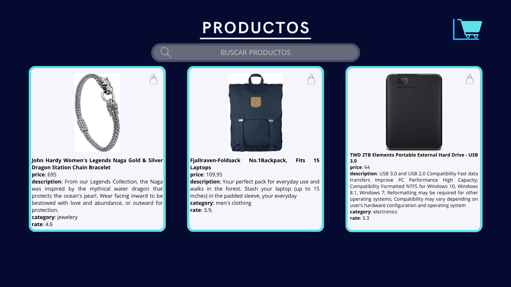
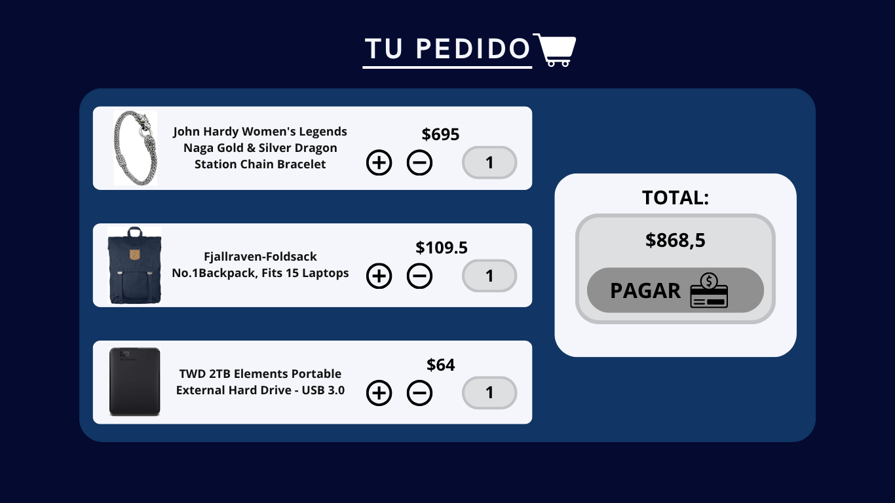

# 📘 Análisis y Diseño de Interfaz

Bienvenido a la sección de evidencia de diseño y análisis del proyecto. A continuación se documentan los bocetos, decisiones de diseño, estructura de datos y justificaciones funcionales desde el enfoque de usabilidad.

---

## 🎨 1. Bocetos / Wireframes

> **Ubicación:** `Estructuracion.md

Los wireframes fueron desarrollados en [Canva](https://www.canva.com) (o indicar herramienta utilizada).

- 🖼️ **Inicio**

En este apartado de Inicio se realiza el diseño de marca con el repectivo logo y slogan de marca, la intencion es hacerlo elegante y minimalista pero que no carezca de gusto y diseño.

- 🔍 **Página de búsqueda y filtros**

- En el apartado productos se puede encontrar la barra de busqueda y los productos disponibles en stock, de forma landin se presentan todos los productos disponibles para agregarlos al carrito de forma rapida.
- 🛒 **Vista del carrito**

- Desde la vista del carrito se pueden observar los productos que el cliente desea agregar, hay opcion de cantidad para aumentar o disminuir la cantidad de productos y la cuenta total para que se pueda pagar de forma rapida y facil.

📂 *Los archivos están disponibles en la carpeta Estructuracion el repositorio.*

---

## 🧠 2. Decisiones de Diseño UI/UX

Se tomaron decisiones basadas en principios de diseño accesible, visual limpio y experiencia fluida. Algunos puntos clave:

- **Diseño minimalista:** se priorizó un estilo visual claro con alto contraste para mejorar la lectura.
- **Navegación intuitiva:** el producto está siempre visible; se usan íconos comprensibles y etiquetas.
- **Retroalimentación visual:** botones con facil legibilidad para el cliente, se penso en un diseño practico y directo para el cliente.

---

