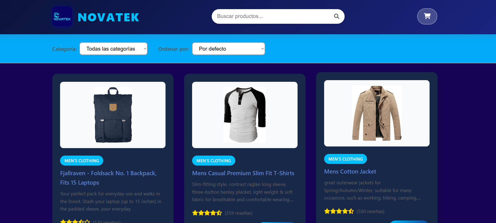
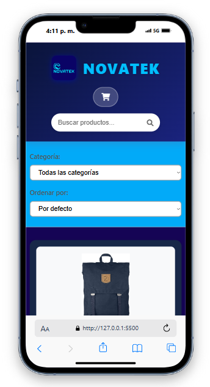

# NOVATEK - Aplicación de E-commerce

## 📋 Descripción del Proyecto

NOVATEK es una aplicación web moderna de e-commerce que consume datos desde la API pública de FakeStore (https://fakestoreapi.com/products). La aplicación permite a los usuarios navegar, filtrar, buscar y comprar productos con una experiencia de usuario intuitiva y completamente responsiva.

## ✨ Características Principales

### 🛒 Funcionalidades Core
- **Consumo de API**: Integración completa con FakeStore API para obtener productos dinámicamente
- **Carrito de Compras**: Sistema completo de carrito con persistencia en localStorage
- **Búsqueda Inteligente**: Búsqueda en tiempo real por título y descripción
- **Filtrado Avanzado**: Filtros por categoría con actualizaciones dinámicas
- **Ordenamiento**: Múltiples opciones de ordenamiento (precio, nombre, rating)
- **Persistencia de Datos**: El carrito se mantiene entre sesiones del navegador

### 🎨 Experiencia de Usuario
- **Diseño Responsivo**: Optimizado para desktop, tablet y móvil
- **Interfaz Moderna**: Diseño con gradientes, sombras y animaciones suaves
- **Feedback Visual**: Notificaciones toast para acciones del usuario
- **Loading States**: Indicadores de carga durante peticiones a la API
- **Estados Vacíos**: Mensajes informativos cuando no hay productos o carrito vacío

### 🔧 Características Técnicas
- **Vanilla JavaScript**: Código modular orientado a objetos
- **CSS Moderno**: Flexbox, Grid, animaciones CSS y diseño responsivo
- **Manejo de Errores**: Gestión robusta de errores de red y datos
- **Optimización de Imágenes**: Placeholders para imágenes no disponibles
- **Accesibilidad**: Controles de teclado y semántica HTML apropiada

## 🚀 Instalación y Uso

### Requisitos Previos
- Navegador web moderno (Chrome, Firefox, Safari, Edge)
- Conexión a internet para consumir la API

### Instalación
1. **Clonar el repositorio**:
   ```bash
   git clone [URL-del-repositorio]
   cd fakestore-project
   ```

2. **Abrir la aplicación**:
   - Opción 1: Abrir `index.html` directamente en el navegador
   - Opción 2: Usar un servidor local:
     ```bash
     # Con Python
     python -m http.server 8000
     
     # Con Node.js (si tienes live-server instalado)
     npx live-server
     ```

3. **Acceder a la aplicación**:
   - Directo: `file:///ruta/a/tu/proyecto/index.html`
   - Servidor local: `http://localhost:8000`

## 📱 Capturas de Pantalla

### Vista de Escritorio
 
- **Página Principal**: Muestra productos en grid con filtros superiores
- **Carrito de Compras**: Modal deslizante con gestión completa de productos
- **Búsqueda y Filtros**: Barra de búsqueda prominente y filtros categorizados

### Vista Móvil
 
- **Diseño Responsivo**: Layout adaptativo para pantallas pequeñas
- **Navegación Táctil**: Botones y controles optimizados para touch
- **Carrito Móvil**: Interfaz de carrito adaptada para móviles

### Estados de la Aplicación
- **Carga de Productos**: Spinner animado durante carga inicial
- **Productos No Encontrados**: Mensaje amigable cuando no hay resultados
- **Carrito Vacío**: Ilustración y mensaje motivacional
- **Notificaciones**: Toast messages para feedback del usuario

## 🏗️ Estructura del Proyecto

```
novatek-project/
├── index.html              # Página principal con toda la aplicación
├── README.md               # Documentación del proyecto
├── analisis.md             # Análisis de diseño y decisiones técnicas
└── design/                 # Carpeta de diseño y wireframes
    ├── wireframes.png      # Bocetos de la interfaz
    └── mockups.png         # Diseños de alta fidelidad
```

## 🛠️ Tecnologías Utilizadas

### Frontend
- **HTML5**: Estructura semántica y accesible
- **CSS3**: 
  - Flexbox y CSS Grid para layouts
  - Variables CSS para consistencia de colores
  - Media queries para responsividad
  - Animaciones y transiciones suaves
- **JavaScript ES6+**:
  - Clases y módulos
  - Async/Await para manejo de promesas
  - Arrow functions
  - Destructuring y spread operator
  - Local Storage API

### APIs y Servicios
- **FakeStore API**: Fuente de datos de productos
- **Font Awesome**: Iconografía
- **Google Fonts**: Tipografía (Segoe UI como fallback)

## 📊 Funcionalidades Detalladas

### Sistema de Carrito
- ✅ Agregar productos al carrito
- ✅ Actualizar cantidades (incrementar/decrementar)
- ✅ Eliminar productos individuales
- ✅ Vaciar carrito completo
- ✅ Cálculo automático de totales
- ✅ Persistencia en localStorage
- ✅ Contador visual de productos

### Filtros y Búsqueda
- ✅ Búsqueda por texto en título y descripción
- ✅ Filtro por categoría dinámico
- ✅ Ordenamiento por:
  - Precio (ascendente/descendente)
  - Nombre (A-Z/Z-A)
  - Rating (mejor calificados primero)
  - Orden por defecto

### Interfaz de Usuario
- ✅ Header fijo con logo, búsqueda y carrito
- ✅ Grid de productos responsivo
- ✅ Cards de producto con información completa
- ✅ Modal de carrito con animaciones
- ✅ Sistema de notificaciones toast
- ✅ Estados de carga y error

## 🎯 Decisiones de Diseño

### Paleta de Colores
- **Primario**: Gradiente púrpura-azul (#667eea → #764ba2)
- **Secundario**: Grises neutros para texto y fondos
- **Éxito**: Verde (#28a745) para confirmaciones
- **Error**: Rojo (#dc3545) para alertas

### Tipografía
- **Principal**: Segoe UI (system font para mejor rendimiento)
- **Fallbacks**: Tahoma, Geneva, Verdana, sans-serif

### Layout y Espaciado
- **Container**: Max-width 1200px centrado
- **Grid**: Auto-fit con mínimo 280px por columna
- **Espaciado**: Sistema consistente basado en múltiplos de 0.5rem

## 🚀 Optimizaciones Implementadas

### Rendimiento
- **Lazy Loading**: Imágenes con fallback para errores
- **Debounce implícito**: Filtros reactivos sin sobrecarga
- **DOM eficiente**: Uso de innerHTML para renderizado batch

### Experiencia de Usuario
- **Feedback inmediato**: Animaciones y transiciones suaves
- **Estados informativos**: Loading, empty states, errores
- **Accesibilidad**: Navegación por teclado, semántica HTML

### Compatibilidad
- **Cross-browser**: Tested en Chrome, Firefox, Safari, Edge
- **Responsive**: Breakpoints en 768px y 480px
- **Fallbacks**: Placeholder images, error handling

## 🧪 Testing Manual

### Casos de Prueba Realizados

1. **Carga inicial de productos**
   - ✅ Productos se cargan correctamente
   - ✅ Categorías se populan dinámicamente
   - ✅ Loading state se muestra/oculta apropiadamente

2. **Funcionalidad de búsqueda**
   - ✅ Búsqueda en tiempo real funciona
   - ✅ Resultados se filtran correctamente
   - ✅ Estado "no encontrado" se muestra cuando corresponde

3. **Sistema de filtros**
   - ✅ Filtro por categoría funciona
   - ✅ Combinación búsqueda + filtro funciona
   - ✅ Ordenamiento funciona correctamente

4. **Carrito de compras**
   - ✅ Agregar productos actualiza contador
   - ✅ Cantidades se manejan correctamente
   - ✅ Eliminación de productos funciona
   - ✅ Persistencia en localStorage funciona
   - ✅ Cálculos de total son correctos

5. **Responsividad**
   - ✅ Layout se adapta a diferentes pantallas
   - ✅ Modal de carrito es usable en móvil
   - ✅ Filtros son accesibles en todas las resoluciones

## 👨‍💻 Autor

**Sergio Lievano**
- GitHub: [@sergiosteven66](https://github.com/sergiosteven66)
- Email: slievano212@ejemplo.com

---

**Nota**: Este proyecto fue desarrollado como parte de un ejercicio de programación web, demostrando habilidades en JavaScript vanilla, consumo de APIs, manipulación del DOM y diseño responsivo.